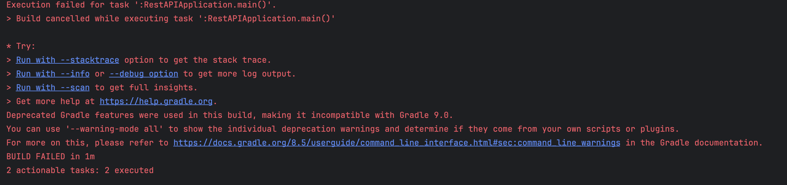
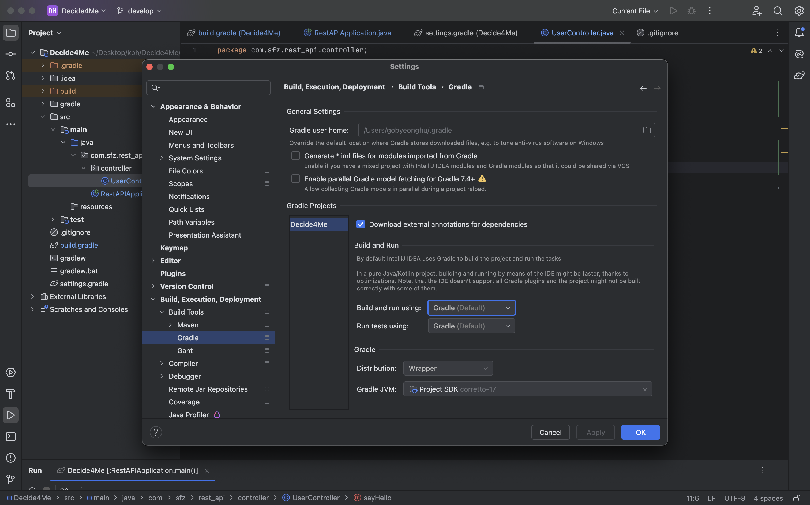
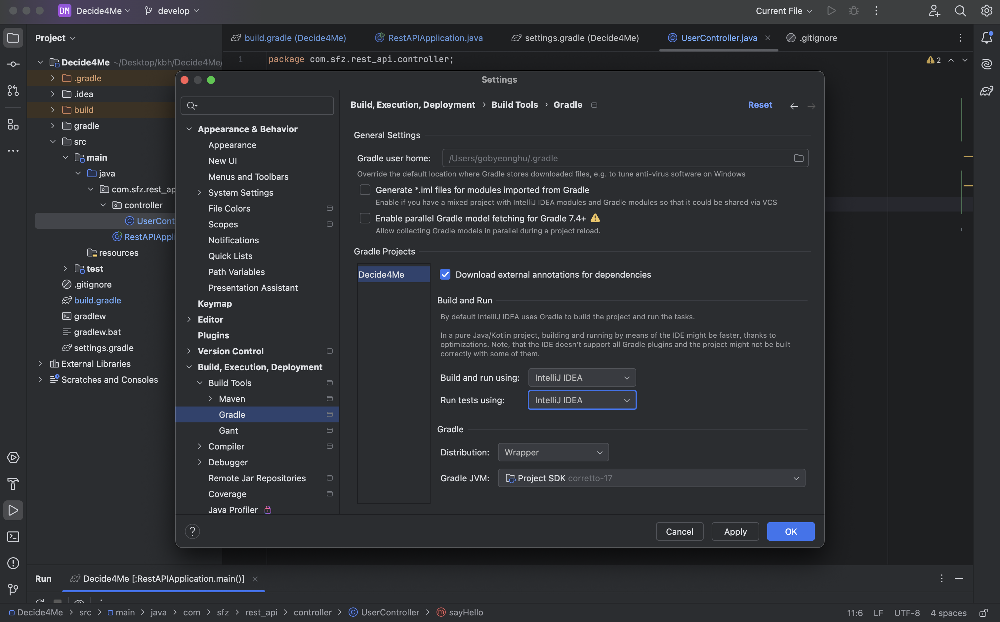

## Build cancelled while executing task

### 에러메시지



```
Execution failed for task ':RestAPIApplication.main()'.
> Build cancelled while executing task ':RestAPIApplication.main()'

* Try:
> Run with --stacktrace option to get the stack trace.
> Run with --info or --debug option to get more log output.
> Run with --scan to get full insights.
> Get more help at https://help.gradle.org.
Deprecated Gradle features were used in this build, making it incompatible with Gradle 9.0.
You can use '--warning-mode all' to show the individual deprecation warnings and determine if they come from your own scripts or plugins.
For more on this, please refer to https://docs.gradle.org/8.5/userguide/command_line_interface.html#sec:command_line_warnings in the Gradle documentation.
BUILD FAILED in 1m
2 actionable tasks: 2 executed
```

### 에러상황

스프링부트 웹을 중지하면 위 메시지와 같은 에러 발생


### 해결방법

- file - setting - Build, Excution, Deployment - Build Tools - Gradle 진입

    


- 둘다 'IntelliJ IDEA'로 변경

    


### 결과
종료시에도 오류가 나지 않고 'Process finished with exit code 130' 정상 출력 