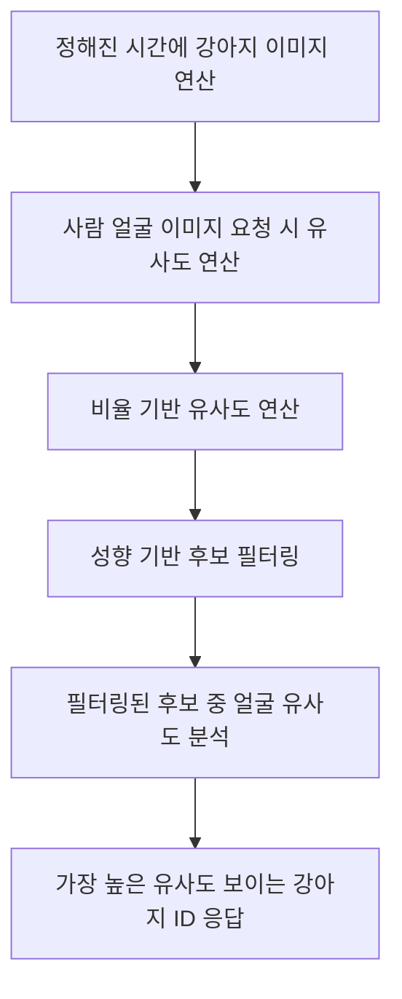

## 문제 1. 예측을 어떻게 수행할 것인가

### 서론

나와 닮은 유기견을 추천해주는 '멍피'를 디벨롭하여 개발중이다.
이때 나와 닮은 강아지와 매칭시켜주는 서버사이드 어플리케이션을 개발한다.

문제는 이와 같다.
유기견 데이터를 매일 업데이트하기 때문에 사람이미지 입력애 대한 결과 값인 강아지 이미지가
매일 바뀐다.
즉 기존에 '결과' set이 한정되어 있는 이미지 예측 방식으로는 구현할수 없다.

### 기능 정의

사용자가 이미지를 업로드하면 '닮은' 강아지 이미지를 반환한다.

### 문제 상황

- 결과가 되는 강아지의 사진 data set이 매일 바뀜 (새로운 사진이 추가되거나 기존 사진이 삭제됨)
- 그렇기 때문에 사전에 한정된 데이터셋으로 트레이닝이 불가능함
- 매일 새롭게 학습시킨다고 해도 결과 값을 자동 매칭 할 수 없음

### 해결 방안 후보

1. 닮았다를 재정의한다.
   : 얼굴이 닮은 강아지의 기준을 눈,코,입 사이의 비율로 결정한다.
   : 매일 새롭게 받아오는 강아지에 대하여 눈,코,입 크기와 거리를 저장한다(배치 시스템)
   : 이 크기, 거리의 유사도가 닮은 꼴의 기준이 되게 한다.

   
2. 얼굴 인식 모델 파인 튜닝
    [face recognization](https://www.nature.com/articles/s41598-023-49522-2)
    
    [ArcFace](https://butter-shower.tistory.com/237)
    :새로운 이미지를 추가하거나 기존 이미지를 삭제할 때마다 즉시 임베딩을 갱신하고 그 벡터 공간에서 유사도를 계산할 수 있다.

3.  Self-supervised Learning 활용
   : 별도의 학습과정 없이 수행 없이 임베딩 업데이트가 가능하다

## 문제 2. 서버 cpu, gpu자원의 부담과 응답시간 지연을 어떻게 개선할 것인가

사전에 구현된 코사인 유사도 기반의 유사도 분석에서는 약 100장의 jpeg이미지에 대해서도
응답시간이 2초 이상 소요되었다.
이를 해결할 방법이 필요하다.

### Python GIL 문제

- 파이썬으로 서버를 만들경우 멀티쓰레딩이 사실상 불가하다.
- CPython 표준 라이브러리로 멀티스레딩을 지원함에도 멀티코어 CPU의 이점을 충분히 활용하지 못한다.

### AI모델 동작의 과도한 컴퓨팅 자원 소모

AI모델(특히 비전)모델은 컴퓨팅파워 소모가 심하다


### 해결방안 탐구

- GPU 활용 최적화: GPU를 효율적으로 사용하려면 배치 처리(batch processing)를 통해 여러 이미지를 한 번에 처리

- FAISS(Facebook AI Similarity Search)사용하여 유사도 검색을 최적화한다.

## 결론

### End-Point

요청:

```css
POST /api/v1/similar-dog
Content-Type: multipart/form-data; boundary=------------------------{boundary_value}
--{boundary_value}
Content-Disposition: form-data; name="imageId"

{image_id}
--{boundary_value}
Content-Disposition: form-data; name="image"; filename="{filename}.(jpg|jpeg|png)"
Content-Type: image/(jpeg|png)

(binary image data)
--{boundary_value}--
```

응답:

```css
HTTP/1.1 200 OK
Content-Type: application/json
{
  "dogImageId": "{similar_dog_image_id}"
}

```

### 방법론

# 강아지 이미지 유사도 분석 방법론

1. **정해진 시간에 이미지 연산**  
   정해진 시간에 강아지 이미지를 참고하여 아직 수행되지 않은 대상들에 대해 눈, 코, 입 크기와 비율을 일괄 연산한다.

2. **얼굴 이미지 유사도 연산**  
   사람의 얼굴 이미지 요청이 들어오면 사전 연산된 데이터를 바탕으로 유사도를 연산한다.  
   - **비율 기반 비교**

3. **성향 기반 필터링**  
   사용자의 성향 응답을 기반으로 연산할 후보군을 필터링한다.

4. **얼굴 유사도 분석**  
   필터링된 후보군 중에서 얼굴 유사도를 상세히 분석한다.

5. **최종 유사도 결과**  
   분석된 결과 중에서 가장 높은 유사도를 보이는 강아지의 ID를 응답한다.

## Flowchart



