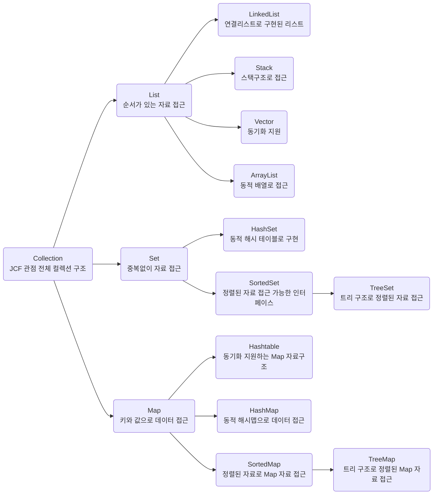
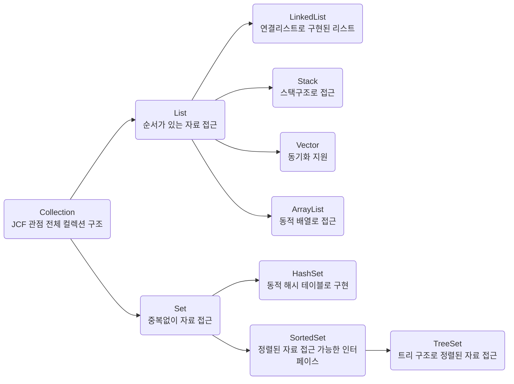
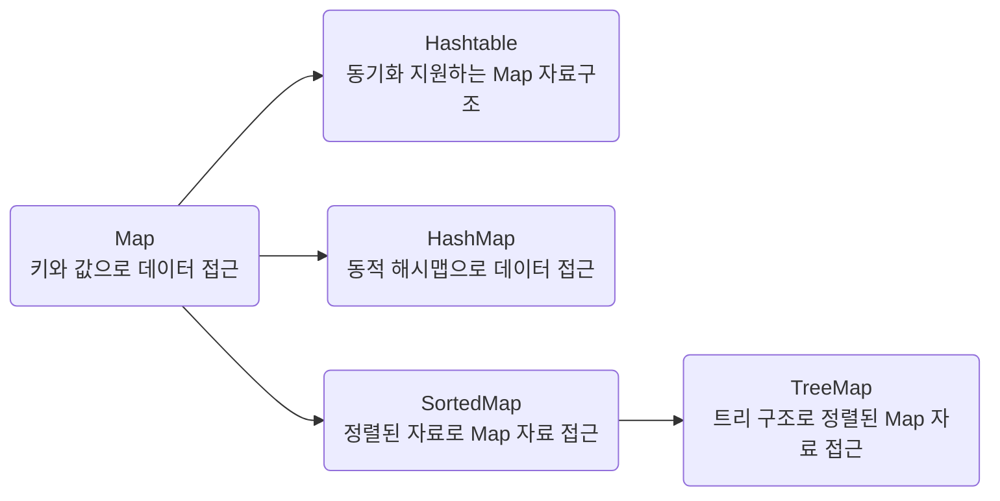

> 본 문서는 다른 언어를 통해 언어, 객체지향에 대한 기본 개념이 있는 개발자가 JAVA를 빠르게 이해하기 위한 문서입니다.

## Java의 역사

Java는 제임스 고슬링(James Gosling)이 개발하였다. 1995년 Sun Microsystems에서 처음 발표되었으며, 현재는 Oracle에서 관리하고 있다.

## Java의 특징

### 엄격한 객체지향
Java는 엄격한 객체지향 프로그래밍 언어이다. 소프트웨어의 모듈성, 유지보수성, 재사용성을 증가시켜 대규모 소프트웨어 개발에 매우 적합하다.

### JVM (Java Virtual Machine)
Java는 "한 번 작성하면 어디서나 실행 가능(Write Once, Run Anywhere, WORA)"이라는 철학을 가지고 있다. 자바로 작성된 프로그램은 JVM 덕분에 어떠한 하드웨어나 플랫폼에서도 동일한 결과물을 실행할 수 있다.

---

## JDK와 JRE


### JDK (Java Development Kit)
JDK는 Java 애플리케이션 개발 및 실행을 위해 필요한 도구를 포함한 소프트웨어 환경이다. 

### JRE (Java Runtime Environment)
JRE는 Java 애플리케이션 실행 환경이다. JDK에 포함되어 있으며, 독립적으로 설치할 수도 있다. 개발 과정에서는 JDK를 설치하고, 배포 환경에서는 JRE만 설치하여 실행 환경을 구성할 수 있다.

---

## Java의 컴파일 및 런타임


### 컴파일(Compile)
컴파일은 `javac` 컴파일러를 사용하여 Java 소스 코드(.java)를 바이트 코드(.class)로 변환하는 과정이다. 이 과정에서 코드의 정적 점검이 이루어진다.

### 런타임(Runtime)
런타임은 컴파일된 바이트 코드를 JVM이 실행하는 과정이다. 이 과정에서 바이트 코드는 기계어로 변환되고, JVM의 메모리 영역에서 실행된다.

---

## JVM (Java Virtual Machine)

JVM은 Java 애플리케이션 실행을 담당하는 가상 머신이다. 아래의 3가지 핵심 구성 요소로 이루어져 있다.

### Class Loader
클래스 로더는 `.class` 파일을 메모리에 로드하고 실행 준비를 한다. 주요 단계는 다음과 같다:
- **로딩:** 바이트 코드를 메모리에 적재한다.
- **링크:** 코드 검증, 메모리 준비, 메모리 주소 변환을 수행한다.
- **초기화:** 정적 변수와 코드 블록을 실행한다.

### Runtime Data Area


Runtime Data Area는 JVM이 프로그램 실행 중 사용하는 메모리 영역이다.
- **PC Register:** 현재 실행 중인 명령을 관리한다.
- **JVM Stack:** 지역 변수와 메서드 실행 데이터를 저장한다.
- **Native Method Area:** 네이티브 코드(C, C++) 실행을 위한 영역이다.
- **Heap:** 객체와 배열을 저장하며, GC(가비지 컬렉터)가 메모리를 관리한다.
- **Method Area:** 클래스 정보와 정적 데이터를 저장한다.

### Execution Engine
실행 엔진은 바이트 코드를 기계어로 변환하고 실행한다.
- **인터프리터:** 바이트 코드를 한 줄씩 변환하여 실행하지만 반복 코드에서 비효율적이다.
- **JIT 컴파일러:** 반복 실행되는 코드를 미리 기계어로 컴파일하여 속도를 향상한다.
- **가비지 컬렉터(GC):** 더 이상 참조되지 않는 객체를 제거하여 메모리를 관리한다.

---


## 기본 자료형 (Primitive Data Types)

자바에서 기본 자료형은 메모리 사용을 최적화하고 효율적인 연산을 가능하게 한다. 각 자료형의 크기와 특성을 이해하면 코드 작성과 디버깅이 용이하다.

| **타입**   | **바이트 크기** | **값의 범위**                                   | **설명**                               |
|------------|-----------------|-----------------------------------------------|---------------------------------------|
| `byte`     | 1               | -128 to 127                                   | 매우 작은 정수 저장용. 네트워크 데이터 처리에 유용 |
| `short`    | 2               | -32,768 to 32,767                             | 작은 정수 저장용. `byte`보다 큰 범위 제공        |
| `int`      | 4               | -2,147,483,648 to 2,147,483,647               | 일반적으로 사용되는 정수 저장용. 가장 자주 사용됨  |
| `long`     | 8               | -9,223,372,036,854,775,808 to 9,223,372,036,854,775,807 | 매우 큰 정수 저장용                    |
| `float`    | 4               | ±3.40282347E+38F                              | 실수 저장용. 부동소수점 연산에 사용             |
| `double`   | 8               | ±1.79769313486231570E+308                     | 더 큰 실수 저장용. 정밀한 부동소수점 연산에 사용    |
| `char`     | 2               | '\u0000' to '\uffff' (0 to 65,535)           | 단일 문자 저장용. 유니코드 문자 표현 가능         |
| `boolean`  | 1 bit           | `true`, `false`                               | 논리값 저장용. 조건문과 제어문에 주로 사용        |

### 기본 자료형 예제

```java
public class PrimitiveExamples {
    public static void main(String[] args) {
        byte myByte = 100;
        short myShort = 5000;
        int myInt = 100000;
        long myLong = 15000000000L;
        float myFloat = 5.75f;
        double myDouble = 19.99;
        char myChar = 'A';
        boolean myBoolean = true;

        System.out.println("Byte: " + myByte);
        System.out.println("Short: " + myShort);
        System.out.println("Int: " + myInt);
        System.out.println("Long: " + myLong);
        System.out.println("Float: " + myFloat);
        System.out.println("Double: " + myDouble);
        System.out.println("Char: " + myChar);
        System.out.println("Boolean: " + myBoolean);
    }
}
```

## 참조 자료형 (Reference Data Types)

참조 자료형은 클래스, 배열, 인터페이스 등을 포함하며, `new` 키워드를 사용하여 객체를 생성한다.

```java
public class SomeClass {
    String text;

    public SomeClass(String text) {
        this.text = text;
    }

    public void greet() {
        System.out.println(this.text);
    }

    public static void main(String[] args) {
        SomeClass object1 = new SomeClass("Hello, Java!");
        object1.greet();
    }
}

```

## 메서드 (Method)

메서드는 특정 작업을 수행하는 코드 블록으로, 접근제어자, 반환 타입, 메서드명, 매개 변수로 구성된다.

```java
public class MethodExample {
    // 메서드 정의
    public static int add(int a, int b) {
        return a + b;
    }

    public static void main(String[] args) {
        int result = add(3, 7);
        System.out.println("Sum: " + result);
    }
}

```

## 접근 제어자 (Access Modifiers)

자바에서 사용되는 접근 제어자(Access Modifiers)는 클래스, 메서드, 변수 등의 접근 범위를 제한하는 키워드이다. 이를 통해 코드의 캡슐화를 실현하고, 의도하지 않은 접근을 방지할 수 있다.

### 접근 제어자의 종류와 특징

| 접근 제어자     | 클래스 내 | 패키지 내 | 하위 클래스 | 전역 |
|----------------|-----------|-----------|-------------|-------|
| `public`       | O         | O         | O           | O     |
| `protected`    | O         | O         | O           | X     |
| `default`      | O         | O         | X           | X     |
| `private`      | O         | X         | X           | X     |

#### **1. public**
- 모든 클래스에서 접근 가능하다.
- 가장 높은 접근 수준을 제공한다.
- 외부 패키지 및 클래스에서도 자유롭게 사용할 수 있다.

```java
public class PublicExample {
    public int value = 10;

    public void displayValue() {
        System.out.println("Value: " + value);
    }
}
```

#### **2. protected**

- 같은 패키지 내의 클래스 또는 다른 패키지의 하위 클래스에서 접근 가능하다.
- 외부 클래스에서는 접근이 제한된다.

```java
public class Parent {
    protected String name = "Parent";

    protected void greet() {
        System.out.println("Hello from " + name);
    }
}

class Child extends Parent {
    public void display() {
        greet(); // 부모 클래스의 protected 메서드 접근 가능
    }
}

```

#### **3. default (접근 제어자를 명시하지 않음)**

- 같은 패키지 내에서만 접근 가능하다.
- 패키지-프라이빗 접근 수준이라고도 한다.
- 접근 제어자를 명시하지 않으면 기본적으로 default 접근 수준이 설정된다.

```java
class DefaultExample {
    int number = 42; // default 접근 제어자

    void showNumber() {
        System.out.println("Number: " + number);
    }
}

```

#### **4. private**

- 선언된 클래스 내부에서만 접근 가능하다.
- 가장 제한적인 접근 수준을 제공하며, 외부에서는 접근할 수 없다.

```java
public class PrivateExample {
    private int secret = 99;

    private void showSecret() {
        System.out.println("Secret: " + secret);
    }

    public void revealSecret() {
        showSecret(); // 클래스 내부에서는 접근 가능
    }
}

```

# 컬렉션 (Java Collections Framework, JCF)

자바 컬렉션 프레임워크(Java Collections Framework, JCF)는 데이터 구조를 효율적으로 다룰 수 있도록 자바에서 제공하는 클래스와 인터페이스의 집합이다. 이를 활용하면 데이터 저장, 검색, 수정, 삭제 등의 작업을 간편하게 수행할 수 있다.

---

## **주요 인터페이스 및 클래스**

### **1. `Collection` 인터페이스**
`Collection`은 모든 컬렉션의 기본 인터페이스로, 요소 추가, 제거, 탐색 등의 메서드를 제공한다.

---

### **2. `Set` 인터페이스**
- 중복을 허용하지 않는 컬렉션이다.
- 요소들의 순서를 보장하지 않는다.
- 주요 구현 클래스:
  - **`HashSet`**: 해시 테이블을 기반으로 하며, 순서를 보장하지 않는다.
  - **`LinkedHashSet`**: 입력된 순서를 유지한다.
  - **`TreeSet`**: 정렬된 순서로 저장한다.

---

### **3. `List` 인터페이스**
- 순서가 있는 컬렉션으로, 중복 요소를 허용한다.
- 요소를 인덱스를 통해 접근할 수 있다.
- 주요 구현 클래스:
  - **`ArrayList`**: 동적 배열로 구현되어 있다.
  - **`LinkedList`**: 연결 리스트로 구현되어 있다.
  - **`Vector`**: 동기화를 지원하며, 스택과 유사하다.
  - **`Stack`**: LIFO(Last In, First Out) 구조를 제공한다.

---

### **4. `Queue` 인터페이스**
- FIFO(First In, First Out) 구조를 가지는 컬렉션이다.
- 주요 구현 클래스:
  - **`LinkedList`**: 연결 리스트 기반의 큐 구현체이다.
  - **`PriorityQueue`**: 우선순위에 따라 요소를 관리한다.

---

### **5. `Map` 인터페이스**
- 키와 값의 쌍으로 이루어진 데이터를 저장하는 컬렉션이다.
- 키는 중복을 허용하지 않으며, 값은 중복을 허용한다.
- 주요 구현 클래스:
  - **`HashMap`**: 해시 테이블 기반으로 데이터를 저장한다.
  - **`LinkedHashMap`**: 입력된 순서를 유지한다.
  - **`TreeMap`**: 키를 정렬된 순서로 저장한다.
  - **`Hashtable`**: 동기화를 지원한다.

---

## **컬렉션 구조 다이어그램**

아래는 Java Collections Framework의 주요 구조를 나타낸 다이어그램이다.



## Collection의 상속 구조

Java Collections Framework의 클래스와 인터페이스는 상속 관계를 통해 구조화되어 있다.

### 1. 기본 상속 구조
- `Collection`은 모든 컬렉션 클래스의 상위 인터페이스이다.
- `List와 Set`은 각각 순서와 중복 여부를 기준으로 구현된다.



### 2. Map 구조

Map은 Collection과 별도로 키-값 쌍 구조를 제공한다.
구현 클래스는 다양한 정렬 및 동기화 방식에 따라 분리된다.



### 참고

- Java Collections Framework 공식 문서: [Oracle Java Documentation](https://docs.oracle.com/javase/tutorial/collections/)
- Wikipedia: [Java Collections Framework](https://en.wikipedia.org/wiki/Java_collections_framework)


---

## Interface

인터페이스는 자바에서 클래스가 구현해야 하는 메서드의 형태를 정의하는 추상적인 형식이다. 인터페이스를 사용하면 객체가 구현해야 할 메서드의 규약을 정할 수 있다. 또한, 다중 상속을 지원하지 않는 자바에서 인터페이스는 여러 클래스에서 상속받을 수 있어 유용하다.

### 사용방법

인터페이스는 다음과 같은 형식으로 정의한다.

```java
[visibility] interface InterfaceName [extends other interfaces] { 
    constant declarations (default is abstract) 
    method declarations static method declarations 
}

//(ex)
public interface InterfaceName extends OtherInterfaces {
  int someIntValue;
  abstract void someMethod();
  static void someStaticMethod();
};
```


예시 코드

1. **기본 인터페이스**
   - 인터페이스는 `abstract` 메서드를 선언한다. 메서드 구현은 인터페이스를 구현한 클래스에서 해야 한다.

```java
public interface Vehicle { int MAX_SPEED = 120; // 상수 선언
void start(); // 추상 메서드 선언
void stop();
}
```
   - `Vehicle` 인터페이스는 두 개의 추상 메서드 `start()`와 `stop()`을 선언한다. `MAX_SPEED`는 상수로 정의되어 있다.

2. **인터페이스 상속**
   - 인터페이스는 다른 인터페이스를 상속받을 수 있다. 이렇게 상속받은 인터페이스는 부모 인터페이스의 메서드를 모두 구현해야 한다.

```java
public interface ElectricVehicle extends Vehicle { 
    void chargeBattery(); // 추가 추상 메서드 선언 
}

```
   - `ElectricVehicle` 인터페이스는 `Vehicle` 인터페이스를 상속하고, `chargeBattery()`라는 새로운 메서드를 추가한다.

3. **정적 메서드 포함**
   - 인터페이스는 `static` 메서드를 선언할 수 있다. `static` 메서드는 인터페이스의 인스턴스를 생성하지 않고도 호출할 수 있다.

```java
public interface Gadget { 
    
    int WARRANTY_PERIOD = 1; // 상수 선언
    void turnOn(); // 추상 메서드 선언
    void turnOff();

    static void resetSettings() { // 정적 메서드 선언
            System.out.println("설정을 초기화합니다.");
        }
}
```
   - `Gadget` 인터페이스는 `turnOn()`과 `turnOff()`라는 추상 메서드 외에도 `resetSettings()`라는 정적 메서드를 선언한다. 이 메서드는 인터페이스 이름으로 직접 호출할 수 있다.

```java
Gadget.resetSettings(); // 정적 메서드 호출
```

## Thread

**Thread**는 **Runnable**의 구현체이다. 스레드는 자바 프로그램에서 병렬 실행을 가능하게 해주는 중요한 기능이다.

### 예시 코드

  ```java
  public class MainSimpleCase1Thread {
      public static void main(String[] args) {
          Thread thread = new Thread();
          thread.start();  // 새 스레드를 시작
      }
  }
```

위 코드는 `Thread` 객체를 생성하고 `start()` 메서드를 호출하여 새로운 스레드를 시작한다.

### 레이스 컨디션 해결 방법 (동시성 문제와 레이스 컨디션 차이)

**Race Condition**은 여러 스레드가 동시에 실행될 때 예상치 못한 결과를 초래하는 문제이다. 이를 해결하기 위한 방법은 다음과 같다.

1. **synchronized (mutex)**: 
   - `synchronized`는 여러 스레드가 공유 자원에 접근할 때, 하나의 스레드만 접근할 수 있도록 보장하는 메커니즘이다. 이를 통해 동시성 문제를 해결할 수 있다.
   - **메서드 동기화 스타일**: `synchronized` 키워드를 메서드 선언에 사용하여, 해당 메서드에 대해 동기화를 적용할 수 있다.
   - **블록 동기화 스타일**: 코드 블록을 `synchronized`로 감싸서 특정 코드 부분에만 동기화를 적용할 수 있다.
   
   **주의**: 동기화에서 중요한 문제는 **데드락(Deadlock)**이다. 데드락은 여러 스레드가 서로가 점유한 자원을 기다리는 상태를 의미한다.

2. **volatile**:
   - `volatile` 키워드는 변수의 값을 스레드마다 독립적으로 저장하지 않고, 항상 메인 메모리에서 읽어온다. 이를 통해 메모리 가시성 문제를 해결할 수 있다.
   - **중요**: `volatile`은 변수의 원자성을 보장하지 않는다. 원자성 문제는 **`atomic`**, **`lock`**, **`mutex`** 등의 메커니즘을 통해 해결할 수 있다.

### Semaphore (세마포어)

**세마포어**는 다수의 스레드가 공유 자원에 접근할 때, 자원의 수를 제한하여 동시성 문제를 해결하는 방법이다.

#### 사용 방법

자바에서 세마포어는 **`java.util.concurrent`** 패키지에 포함되어 있으며, **`Semaphore`** 클래스를 사용하여 구현할 수 있다. `Semaphore` 클래스는 두 가지 주요 메서드인 **`acquire()`**와 **`release()`**를 제공한다.

1. **`acquire()`**:
   - 세마포어의 허용 가능한 값이 0보다 큰 경우 값을 감소시키고 자원을 획득한다.
   - 값이 0이면, 자원이 반환될 때까지 대기한다.

2. **`release()`**:
   - 세마포어의 값을 증가시키고, 대기 중인 스레드가 자원을 사용할 수 있도록 허용한다.

세마포어는 크게 **바이너리 세마포어**와 **카운팅 세마포어**로 나눌 수 있다.

- **바이너리 세마포어**: 값이 1로만 설정되며, 주로 한 번에 하나의 스레드만 자원에 접근하도록 제한하는 데 사용된다.
- **카운팅 세마포어**: 값이 여러 개로 설정될 수 있으며, 특정 개수의 스레드만 자원에 접근할 수 있도록 제한한다.


### Lambda

`lambda` 키워드는 익명 함수(anonymous function)를 정의하는 데 사용된다. 이는 프로그래밍 언어에서 함수를 일급 객체(first-class citizen)로 취급하는 개념의 기반이다.

#### 1. **변수에 할당할 수 있다**
함수는 변수에 할당될 수 있다. 이를 통해 함수 자체를 변수처럼 사용할 수 있다.

#### 2. **함수의 매개변수로 전달할 수 있다**
함수는 다른 함수의 매개변수로 전달될 수 있다. 이를 통해 함수의 동작을 매개변수로 전달하여 더 유연한 코드 구성을 할 수 있다.

#### 3. **함수의 반환값으로 사용할 수 있다**
함수는 다른 함수의 반환값으로 사용할 수 있다. 이를 통해 함수를 생성하고 반환하는 함수, 즉 고차 함수(higher-order function)를 만들 수 있다.

이제 우리는 함수형 패러다임을 깊이 다루지 않으므로 람다식의 기본 개념만 짧게 살펴보자.

#### 💡 참고
여기서는 `Stream API`의 기본적인 사용법만 살펴보고, 람다식과 결합되는 방식에 대해 알아보자.

우리는 이미 자바스크립트를 사용하면서 `Promise`, `fetch` 함수, `.then()` 등을 활용한 메서드 체이닝을 경험한 바 있다. 이러한 문법은 자바의 **`Stream API`**에도 동일하게 존재한다. 이하에서는 **`Stream API`**를 간단히 '스트림'이라고 부르겠다.

자바에서 함수를 일급 객체로 다룰 때는 크게 `Function API`와 `Stream API` 두 가지가 있다. 여기서는 스트림에 대해서만 다룬다.

### **스트림의 주요 특징**

1. **선언형 처리**: 스트림을 사용하면 반복문 대신 선언형으로 데이터를 처리할 수 있다.
   
   [선언형? 명령형?](https://www.notion.so/a2413fdbf08f40dabff5c4261323de83?pvs=21)에서 자세히 설명한다.

2. **체이닝**: 여러 연산을 체인 형태로 연결할 수 있다.
   
   여러 개의 함수를 이미지처럼 이어 붙여 사용할 수 있다.

   

3. **지연 연산**: 중간 연산은 지연(lazy) 연산이며, 최종 연산이 호출될 때까지 실행되지 않는다.
4. **병렬 처리**: 쉽게 병렬 스트림을 생성하여 병렬 처리를 수행할 수 있다.

[Stream API를 사용한 유저 아이디 조회 예제](https://www.notion.so/Stream-API-e82a772c2fc540ddb3e49e9b3edb4c50?pvs=21)에서 더욱 자세히 살펴볼 수 있다.

---

### Stream API

스트림 API는 람다식을 포함한 함수형 인터페이스를 이용하여 데이터 소스(컬렉션, 배열, 난수, 파일 등)를 처리하고, 데이터를 조작, 가공, 변환하여 원하는 결과를 얻을 수 있게 해주는 자바의 인터페이스이다.

#### 사용 이유
스트림 API를 사용하는 이유는 스트림을 통해 선언형 방식으로 컬렉션 데이터를 처리할 수 있기 때문이다. 스트림을 사용하면 반복문과 조건문을 여러 줄로 작성하지 않고도 간결하고 직관적인 코드로 작성할 수 있다. 또한, 스트림 API는 다양한 데이터 소스에 대해 일관된 작업을 수행하고, 병렬 처리를 통해 성능을 최적화할 수 있는 유연성을 제공한다.

---

### 람다 표현식 기본 형식

```java
/* 기본 형식 */
(parameters) -> expression
(parameters) -> { statements; }
```

#### 실제 코드 예시

- 매개변수가 없고 반환값도 없는 람다 표현식:
  ```java
  () -> System.out.println("Hello, World!");
  ```
- 하나의 매개변수를 받고, 그 매개변수를 출력하는 람다 표현식:
  ```java
  (x) -> System.out.println(x);
  ```
- 두 개의 매개변수를 받아 그 합을 반환하는 람다 표현식:
  ```java
  (a, b) -> a + b;
  ```
- 여러 줄의 코드가 있는 람다 표현식:
  ```java
  (a, b) -> {
      int sum = a + b;
      return sum;
  };
  ```

---

### 스트림 API 예제

```java
import java.util.Arrays;
import java.util.List;

public class StreamExample {
    public static void main(String[] args) {
        // 리스트 생성
        List<String> names = Arrays.asList("김철수", "이영희", "박민수", "최지우", "한예슬");

        // 스트림 생성 및 중간 연산과 최종 연산 적용
        List<String> filteredNames = names.stream()
                                          .filter(name -> name.startsWith("김"))
                                          .toList();

        // 결과 출력
        filteredNames.forEach(System.out::println); // 출력: 김철수
    }
}
```

#### 예제 설명

1. `List<String>` 타입의 `names` 리스트를 생성한다.
2. `names.stream()`을 호출하여 스트림을 생성한다.
3. `filter` 중간 연산을 사용하여 이름이 "김"으로 시작하는 항목만 필터링한다.
4. `collect` 최종 연산을 사용하여 필터링된 결과를 리스트로 수집한다.
5. `forEach`를 사용하여 결과 리스트의 각 요소를 출력한다.

---

### 중간 연산과 최종 연산

- **중간 연산**은 또 다른 스트림을 반환하며, 최종 연산이 호출될 때까지 실제로 수행되지 않는다. 이를 **지연 평가(lazy evaluation)**라고 한다.
- **최종 연산**은 스트림을 소모하여 결과를 만드는 연산이다. 최종 연산이 호출되면 스트림의 요소들이 실제로 처리되며, 최종 연산 후에는 스트림을 더 이상 사용할 수 없다.

#### 예시

```java
import java.util.*;
import java.util.stream.*;

public class StreamExample {
    public static void main(String[] args) {
        List<String> names = Arrays.asList("Alice", "Bob", "Charlie", "David", "Anna");

        // 스트림을 생성하고 중간 연산과 최종 연산을 수행
        List<String> result = names.stream()
            .filter(name -> name.startsWith("A"))   // 중간 연산: 필터링
            .map(String::toUpperCase)               // 중간 연산: 대문자로 변환
            .sorted()                               // 중간 연산: 정렬
            .collect(Collectors.toList());          // 최종 연산: 리스트로 수집

        System.out.println(result); // 출력: [ALICE, ANNA]
    }
}
```

---

### 스트림 API의 추상화와 파이프라인

스트림 API는 데이터를 처리하는 복잡한 로직을 추상화하여 간단하고 직관적인 방법으로 데이터를 다룰 수 있게 해준다. 데이터 소스의 세부 사항을 신경 쓰지 않고 데이터 처리 작업에 집중할 수 있다.

#### 전통적인 방법 vs 스트림 사용법

1. **전통적인 방법**
   
   명령형 프로그래밍 스타일로, 데이터 처리의 각 단계를 명확하게 작성해야 한다.
   
   ```java
   import java.util.ArrayList;
   import java.util.Arrays;
   import java.util.List;

   public class TraditionalExample {
       public static void main(String[] args) {
           List<String> names = Arrays.asList("김철수", "이영희", "박민수", "최지우", "한예슬");
           List<String> result = new ArrayList<>();

           // 필터링 및 변환 작업
           for (String name : names) {
               if (name.startsWith("이")) {
                   result.add(name.toUpperCase());
               }
           }

           // 결과 출력
           for (String name : result) {
               System.out.println(name);
           }
       }
   }
   ```

2. **스트림을 사용한 방법**
   
   선언형 프로그래밍 스타일로, 데이터를 어떻게 처리할지 선언만 하면 된다.
   
   ```java
   import java.util.Arrays;
   import java.util.List;
   import java.util.stream.Collectors;

   public class StreamExample {
       public static void main(String[] args) {
           List<String> names = Arrays.asList("김철수", "이영희", "박민수", "최지우", "한예슬");

           // 스트림 파이프라인: 필터링 및 변환 작업
           List<String> result = names.stream()               // 스트림 생성
                                      .filter(name -> name.startsWith("이")) // 필터링
                                      .map(String::toUpperCase)  // 변환
                                      .collect(Collectors.toList()); // 결과 수집

           // 결과 출력
          

            result.forEach(System.out::println); // 출력: 이영희
       }
   }
   ``` 

--- 


# Annotation

<aside>
💡 현 시대의 자바에서 애너테이션은 Spring AOP와 함께 쓸 때 진가를 발휘합니다. AOP 없이 커스텀 애너테이션을 사용한다면 복잡도가 올라가고 유지보수가 더 어려워질 수 있습니다.
</aside>

애노테이션(Annotation)은 라틴어 "annotatio"에서 유래한 용어입니다. 라틴어로 "annotatio"는 "덧붙여 놓은 주석"이라는 뜻입니다. 영어의 "annotation"도 동일한 어원을 가지고 있으며, "주석을 다는 행위" 또는 "주석 자체"를 의미합니다.

Java에서는 이 개념을 차용하여, 코드에 대한 메타데이터를 제공하는 특별한 형태의 문법으로 애노테이션을 도입했습니다. 애노테이션은 “**@**” 기호와 함께 사용되며, 클래스, 메서드, 변수, 매개변수 등에 대한 부가 정보를 제공합니다.

예를 들어:

```java
@Override
public String toString() {
   // ...
}
```

여기서 `@Override`는 해당 메서드가 상위 클래스의 메서드를 오버라이드하고 있음을 나타내는 애노테이션입니다. 이렇게 애노테이션을 통해 코드에 대한 메타데이터를 작성하고, 이를 컴파일러나 런타임에서 활용할 수 있게 됩니다.

자바에서는 다양한 내장 애노테이션이 제공되며, 사용자 정의 애노테이션도 만들 수 있습니다.

## **자바 내장 애노테이션**

자바는 몇 가지 기본 애노테이션을 내장하고 있습니다. 이들은 주로 코드의 동작이나 의미를 명확히 하기 위해 사용됩니다.

1. **@Override**
    - 메서드가 수퍼클래스의 메서드를 오버라이드하고 있음을 나타냅니다.

    ```java
    public class SuperClass {
        public void display() {
            System.out.println("SuperClass Method display()!");
        }
    }
    
    public class SubClass extends SuperClass {
        @Override
        public void display() {
            System.out.println("SubClass display()!");
        }
    }
    ```

2. **@Deprecated**
    - 특정 요소(클래스, 메서드 등)가 더 이상 사용되지 않음을 나타내며, 다른 대안이 있음을 알립니다.
    - 이 애노테이션은 오픈소스 혹은 사내 자체 라이브러리가 있을 때 사용될 수 있으나, 그렇지 않으면 사용될 일이 적습니다.

    ```java
    public class Example {
        @Deprecated
        public void oldMethod() {
            System.out.println("This method is deprecated");
        }
    
        public void newMethod() {
            System.out.println("This method is the replacement");
        }
    }
    ```

## 커스텀 애노테이션

### **사용 이유**

1. **메타데이터 제공**: 런타임이나 컴파일 타임에 필요한 정보를 제공하여 동적으로 동작을 제어할 수 있습니다.

#### 예시

**MyCustomAnnotation.java**

```java
import java.lang.annotation.Retention;
import java.lang.annotation.RetentionPolicy;
import java.lang.annotation.ElementType;
import java.lang.annotation.Target;

// 이 어노테이션은 런타임에도 유지됩니다.
// 이는 JVM이 런타임에 어노테이션을 읽을 수 있음을 의미합니다.
// 이를 통해 런타임에 어노테이션 정보를 처리하는 코드를 작성할 수 있습니다.
@Retention(RetentionPolicy.RUNTIME)

// 이 어노테이션은 메소드에만 적용될 수 있습니다.
// 이는 MeasureTime 어노테이션을 메소드 선언부에만 붙일 수 있음을 의미합니다.
@Target(ElementType.METHOD)
public @interface MyCustomAnnotation {
    String value() default "기본 값";
    int number() default 0;
}
```

**AnnotationProcessor.java**

```java
import java.lang.reflect.Method;

public class AnnotationProcessor {

    public void processAnnotations(Object obj) {
        try {
            Method[] methods = obj.getClass().getDeclaredMethods();

            for (Method method : methods) {
                if (method.isAnnotationPresent(MyCustomAnnotation.class)) {
                    MyCustomAnnotation annotation = method.getAnnotation(MyCustomAnnotation.class);

                    System.out.println("메서드 이름: " + method.getName());
                    System.out.println("value: " + annotation.value());
                    System.out.println("number: " + annotation.number());

                    method.invoke(obj);
                }
            }
        } catch (Exception e) {
            e.printStackTrace();
        }
    }
}
```

**MyClass.java**

```java
public class MyClass {

    @MyCustomAnnotation(value = "테스트", number = 10)
    public void myMethod() {
        System.out.println("myMethod가 실행되었습니다.");
    }
}
```

**Main.java**

```java
public class Main {
    public static void main(String[] args) {
        MyClass myClassInstance = new MyClass();
        AnnotationProcessor processor = new AnnotationProcessor();
        processor.processAnnotations(myClassInstance);
    }
}
```

### 아쉬운 점

`new MyClass().myMethod()`를 호출했을 때 함수가 실행되기 전에 `@MyCustomAnnotation`이 자동으로 호출되기를 기대할 수도 있습니다. (파이썬처럼)

하지만 자바는 기본적으로 이러한 동작 방식을 지원하지 않습니다. 특정 메서드 머리에 달려 있는 애너테이션이 자동으로 실행되게 하려면 Spring의 AOP 기능을 사용해야 하지만, 여기서는 논외로 하겠습니다.

---

## 조금 더 깊게 이해하기

<aside>
💡 런타임에 클래스를 동적으로 가져올 수 있다. 스프링은 리플렉션으로 만들어졌다고 해도 과언이 아니다.
</aside>

리플렉션(Reflection)은 자바에서 실행 시간에 클래스, 메서드, 필드, 인터페이스 등을 동적으로 검사하고 조작할 수 있는 기능입니다. 이를 통해 코드가 실행되는 동안에도 클래스의 구조나 상태를 분석하고 수정할 수 있습니다.

### **용어 정의**

- **리플렉션(Reflection)**: 런타임 시점에 클래스나 객체의 메타데이터(클래스의 구조, 메서드, 필드 등)를 동적으로 접근하고 조작할 수 있는 기능입니다.

### **사용 이유**

리플렉션은 다음과 같은 이유로 사용됩니다:

| **사용 이유**              | **설명**                                                                 |
|---------------------------|------------------------------------------------------------------------|
| **동적 동작**               | 실행 시점에 클래스나 객체의 정보를 얻고, 이를 바탕으로 동적으로 동작을 결정할 수 있습니다. |
| **프레임워크 및 라이브러리 개발** | 다양한 타입의 객체를 동적으로 생성하고 처리해야 하는 프레임워크나 라이브러리에서 자주 사용됩니다. |
| **디버깅 및 테스트**        | 클래스의 내부 구조를 검사하여 디버깅이나 테스트를 더 효과적으로 수행할 수 있습니다. |
| **접근 제한 무시**          | **`private`**, **`protected`** 등 접근 제한자를 무시하고 필드나 메서드에 접근할 수 있습니다. |

### **사용 방법**

리플렉션을 사용하여 클래스의 메타데이터를 동적으로 접근하고 조작하는 방법을 예제를 통해 알아보겠습니다.

## 리플렉션의 다양한 사용 방법

### **1. 클래스 정보 얻기**

클래스 정보를 얻기 위해 **`Class`** 객체를 사용합니다.

```java
public class ReflectionExample {
    public static void main(String[] args) {
        try {
            // 클래스 객체를 가져오는 방법 1: Class.forName()
            Class<?> clazz = Class.forName("com.example.MyClass");

            // 클래스 객체를 가져오는 방법 2: 클래스명.class
            Class<?> clazz2 = MyClass.class;

            // 클래스 객체를 가져오는 방법 3: 객체의 getClass() 메서드 사용
            MyClass myClassInstance = new MyClass();
            Class<?> clazz3 = myClassInstance.getClass();

            System.out.println("Class name: " + clazz.getName());
        } catch (ClassNotFoundException e) {
            e.printStackTrace();
        }
    }
}
```

### **2. 필드 접근**

리플렉션을 사용하여 클래스의 필드에 접근하고 값을 설정할 수 있습니다.

```java
import java.lang.reflect.Field;

public class ReflectionExample {
    public static void main(String[] args) {
        try {
            MyClass myClassInstance = new MyClass();

            // 클래스 객체를 가져옴
            Class<?> clazz = myClassInstance.getClass();

            // 필드를 가져옴
            Field field = clazz.getDeclaredField("privateField");

            // 접근 가능하도록 설정
            field.setAccessible(true);

            // 필드 값 설정
            field.set(myClassInstance, "새로운 값");

            // 필드 값 출력
            System.out.println("Updated Field Value: " + field.get(myClassInstance));
        } catch (Exception e) {
            e.printStackTrace();
        }
    }
}

class MyClass {
    private String privateField = "기본 값";
}
```

### **3. 메서드 호출**

리플렉션을 사용하여 클래스의 메서드를 호출할 수 있습니다.

```java
import java.lang.reflect.Method;

public class ReflectionExample {
    public static void main(String[] args) {
        try {
            MyClass myClassInstance = new MyClass();

           

 // 클래스 객체를 가져옴
            Class<?> clazz = myClassInstance.getClass();

            // 메서드 객체 가져오기
            Method method = clazz.getDeclaredMethod("myMethod");

            // 메서드 호출
            method.invoke(myClassInstance);
        } catch (Exception e) {
            e.printStackTrace();
        }
    }
}

class MyClass {
    private void myMethod() {
        System.out.println("myMethod가 호출되었습니다.");
    }
}
```

### **4. 생성자 호출**

리플렉션을 사용하여 클래스의 생성자를 호출할 수 있습니다.

```java
import java.lang.reflect.Constructor;

public class ReflectionExample {
    public static void main(String[] args) {
        try {
            // 클래스 객체를 가져옴
            Class<?> clazz = MyClass.class;

            // 생성자 객체를 가져옴
            Constructor<?> constructor = clazz.getDeclaredConstructor(String.class);

            // 접근 가능하도록 설정
            constructor.setAccessible(true);

            // 생성자 호출
            MyClass myClassInstance = (MyClass) constructor.newInstance("Hello Reflection!");

            // 결과 출력
            myClassInstance.displayMessage();
        } catch (Exception e) {
            e.printStackTrace();
        }
    }
}

class MyClass {
    private String message;

    public MyClass(String message) {
        this.message = message;
    }

    public void displayMessage() {
        System.out.println("Message: " + message);
    }
}
```

