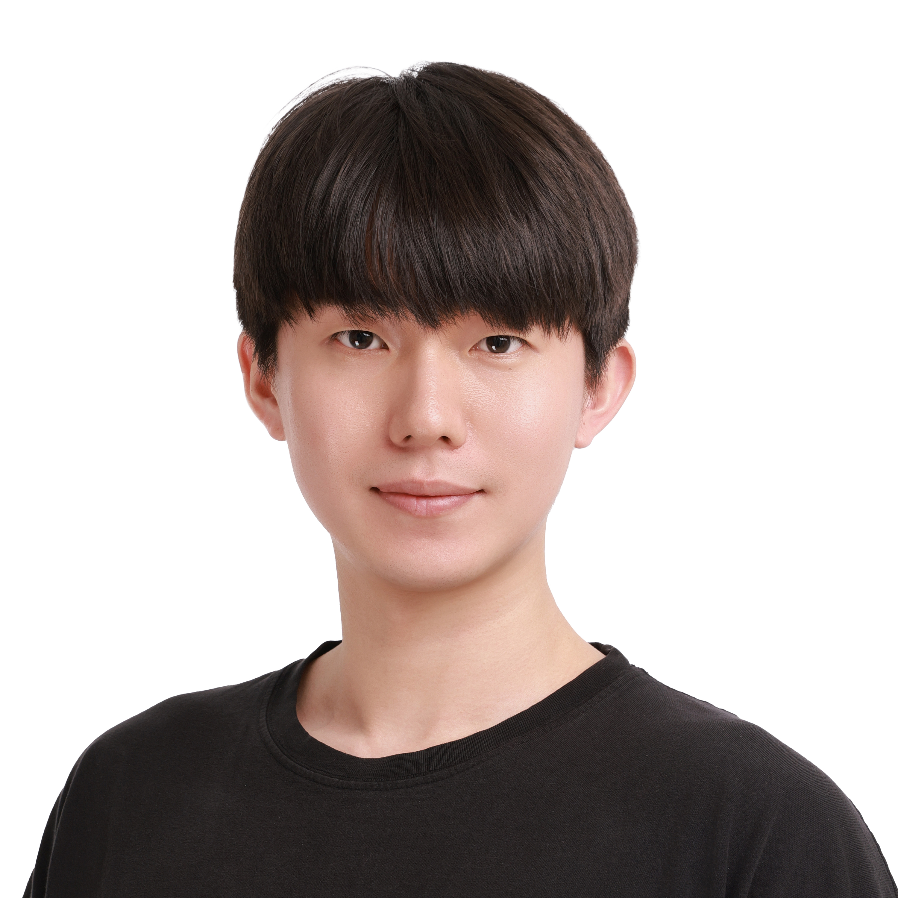

  

# 고병후
# Go Byeonghu
📧 byeonghu@gmail.com &nbsp;&nbsp; 🌐 [github](https://github.com/GoByeonghu) &nbsp;&nbsp; 📱 +82-10-6746-6704  
📍 Incheon, Korea

---

## Education

**컴퓨터공학 학사**  
경희대학교 국제캠퍼스, 컴퓨터공학과  
2017년 3월 1일 ~ 2023년 8월 16일 졸업

**SW 부트캠프 수료**  
카카오클라우드스쿨 in Jeju  
2024년 4월 ~ 2024년 10월  
풀스택 개발자 과정

---

## Key Skills

- Programming Languages: C++, Java, Python
- Web Development: Spring, Django
- Database Management: MySQL
- Infrastructure: AWS EC2
- Version Control: Git, GitHub
- Agile Development Methodologies

## Experienced Skills

- Programming Languages: JavaScript
- Web Development: HTML, CSS, React.js, Node.js
- Database Management: MongoDB
- - Infrastructure: AWS S3, Nginx

---

## Projects

**미작성 단락**  

**E-commerce Website**  
*Role: Lead Developer*  
Developed a full-stack e-commerce website using MERN stack, allowing users to browse products, add them to the cart, and make purchases securely.

**Personal Blog**  
*Role: Sole Developer*  
Created a personal blog website using Jekyll, featuring custom themes and layouts, with integration of Disqus commenting system.

---

## Certifications

- 정보처리기사

---

## Interests

- 서비스 창작
- 프로그래밍
- 독서
- 음악 감상
- 운동 (복싱, 헬스)

---

